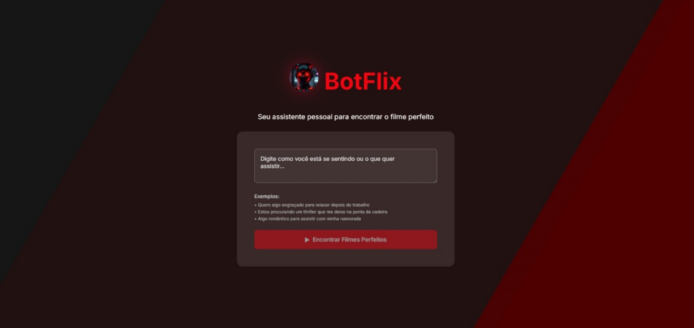

#  BotFlix 

BotFlix é uma aplicação web que ajuda usuários a encontrar filmes perfeitos com base em seu humor ou preferências. Utiliza inteligência artificial para interpretar prompts e consultar a API do TMDB (The Movie Database) para exibir informações detalhadas dos filmes.

## Funcionalidades

- **Busca Inteligente**: Insira seu humor ou preferência (ex.: "filme de ação emocionante") e receba sugestões personalizadas.
- **Integração com IA**: Usa Google Gemini para processar e interpretar o prompt do usuário.
- **Exibição de Filmes**: Mostra pôster, título, sinopse e avaliação do filme selecionado.
- **Interface Responsiva**: Design moderno com animações, otimizado para desktop e mobile.
- **Feedback Visual**: Botão de busca com estado de carregamento e validação de entrada.

## Tecnologias Utilizadas


- **Frontend**:
  - HTML5
  - CSS3 (com animações e responsividade)
  - JavaScript (ES6+)
- **APIs e Serviços**:
  - TMDB API (para dados de filmes)
  - Google Gemini AI (para processamento de prompts)
  - n8n (para criação de webhook e integração entre Gemini e TMDB)
- **Ferramentas de Desenvolvimento**:
  - Visual Studio Code
  - Live Server (para desenvolvimento local)

## Estrutura do Projeto

```
├── 📁 src
│   ├── 📁 css
│   │   ├── 🎨 animations.css  # Animações de fundo e elementos
│   │   ├── 🎨 reset.css       # Reset de estilos padrão
│   │   ├── 🎨 responsivo.css  # Estilos responsivos
│   │   └── 🎨 sytle.css       # Estilos principais
│   ├── 📁 img
│   │   ├── 🖼️ botflix-robot.jpg
│   │   └── 🖼️ desktop-botflix.jpeg
│   └── 📁 js
│       └── 📄 index.js        # Lógica JavaScript da aplicação
├── 📝 README.md
└── 🌐 index.html              # Arquivo Principal HTML
```

## Instalação

1. Clone o repositório:
git clone https://github.com/seu-usuario/botflix-api.git
cd botflix-api
2. Abra o projeto no Visual Studio Code.

3. Instale a extensão "Live Server" se necessário.

4. Clique com o botão direito em `index.html` e selecione "Open with Live Server" para executar localmente.

## Uso

1. Abra a aplicação no navegador (via Live Server).
2. Digite seu humor ou preferência no campo de entrada (ex.: "filme romântico triste").
3. Clique em "Encontrar Filmes Perfeitos" ou pressione Enter.
4. Aguarde o processamento e veja o filme sugerido aparecer na tela.

**Nota**: Certifique-se de que o webhook n8n esteja ativo e configurado com chaves válidas para TMDB e Gemini. Limites de cota da API gratuita podem aplicar (ex.: 20 solicitações/dia no Gemini).

## Capturas de Tela

 

## Contribuição

Contribuições são bem-vindas! Abra uma issue ou pull request no repositório.

## Licença

Este projeto é licenciado sob a MIT License.